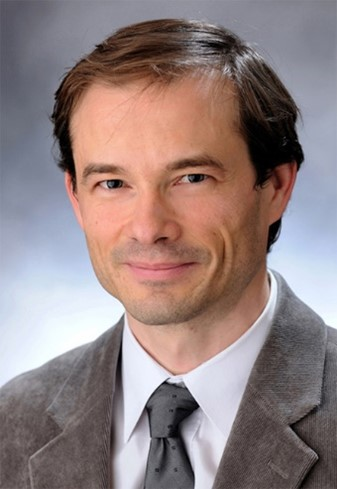

Az MTA doktora, a BME VBK egyetemi tanára, dékánhelyettese. 1998 óta foglalkozik C-vitamin kutatással, PhD fokozatát a Semmelweis Egyetem Molekuláris Orvostudományok Doktori Iskolájában szerezte 2003-ban, dolgozatában a C-vitamin fehérjék térszerkezet kialakításában betöltött szerepével foglalkozott. MTA doktori fokozatát 2017-ben védte meg Vízoldható antioxidánsok kéz a kézben: C-vitamin és Glutation címmel. Jelenleg Biokémiát, Patobiokémiát és Klinikai Kémiát tanít a BME-n. Vendégkutatóként C-vitamin transzporttal és anyagcserével foglalkozott a Sienai, a Molise és az Antwerpeni Egyetemen. Számos nemzetközi folyóirat szerkesztőbizottsági tagja. Jelenleg a C-vitamin sejthalálban betöltött szerepét vizsgálja.

 <table class="picture">
<tr>
<td>

    
  
Szarka András

</td>
</tr>
</table>
