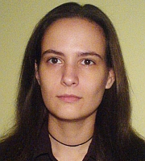

Szőllősi Ágnes a BME Kognitív Tudományi Tanszékének oktatója, valamint a Természettudományi Kutatóközpont munkatársa. Tudományos érdeklődése: Különböző tanulási stratégiák hatékonysága; Érzelmi emlékezet.

 <table class="picture">
<tr>
<td>

    
  
Szőllősi Ágnes

</td>
</tr>
</table>
