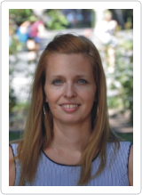

Okleveles ipari termék- és formatervező mérnök, jelenleg a HDR Tanszéken tanársegédként dolgozik. Fő szakterületei a nemnewtoni folyadékok vizsgálata áramlástechnikai gépek esetében valamint hemodinamikai (véráramlás) kutatások.

<table class="picture">
<tr>
<td>

    
  
Till Sára

</td>
</tr>
</table>
