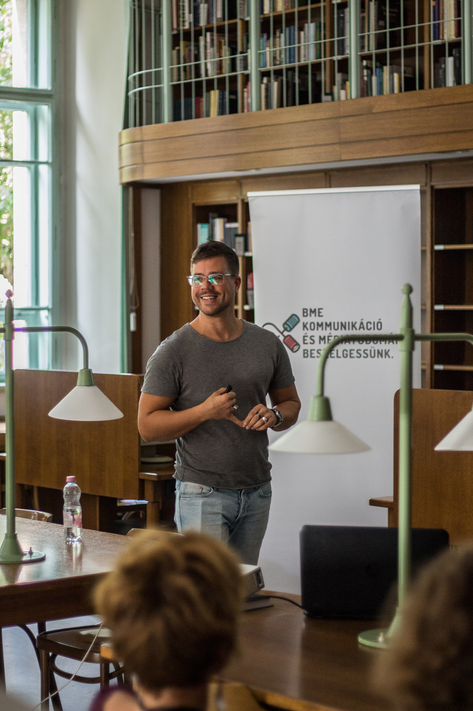

Médiakutató, kommunikációs szakember, tanácsadó. A kommunikációs technológiák és a kultúra interakciójával, valamint a digitális tartalomipar közpolitikáival és stratégiájával foglalkozik. A Budapesti Műszaki és Gazdaságtudományi Egyetem Szociológia és Kommunikáció Tanszékének MTA Bolyai János Kutatói Ösztöndíjas egyetemi docense, a BME Kommunikáció- és Médiatudomány Mesterszak Digitális Média szakirányának vezetője, a Magyar Online és Digitális Médiatörténet (MODEM) projekt vezetője. 2018–19-ben a Central European University Center for Media, Data and Society kutatója, 2013–17 között a Magyarországi Tartalomszolgáltatók Egyesülete főtitkára, 2012–13-ban a Columbia Egyetem Fulbright-ösztöndíjas kutatója volt. Legutóbbi munkái: “We have never been part of the journalistic profession” – Self-perceptions and professionalization of online journalists in the early era of Hungarian digital media (Media History, 2020) és Popular Music, Technology, and the Changing Media Ecosystem: From Cassettes to Stream (szerk., Barna Emíliával) (Palgrave Macmillan, 2020).

 <table class="picture">
<tr>
<td>

    
  
Tófalvy Tamás

</td>
</tr>
</table>
