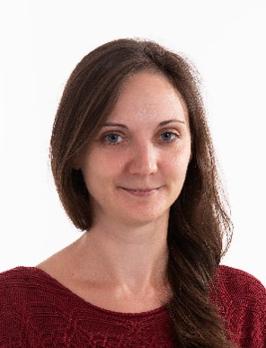

Urbin Ágnes a Mechatronika, Optika és Gépészeti Informatika Tanszék tanársegéde. Kutatási területe a színlátás, azon belül a kromatikus adaptáció és hatásai.

 <table class="picture">
<tr>
<td>

    
  
Urbin Ágnes

</td>
</tr>
</table>
