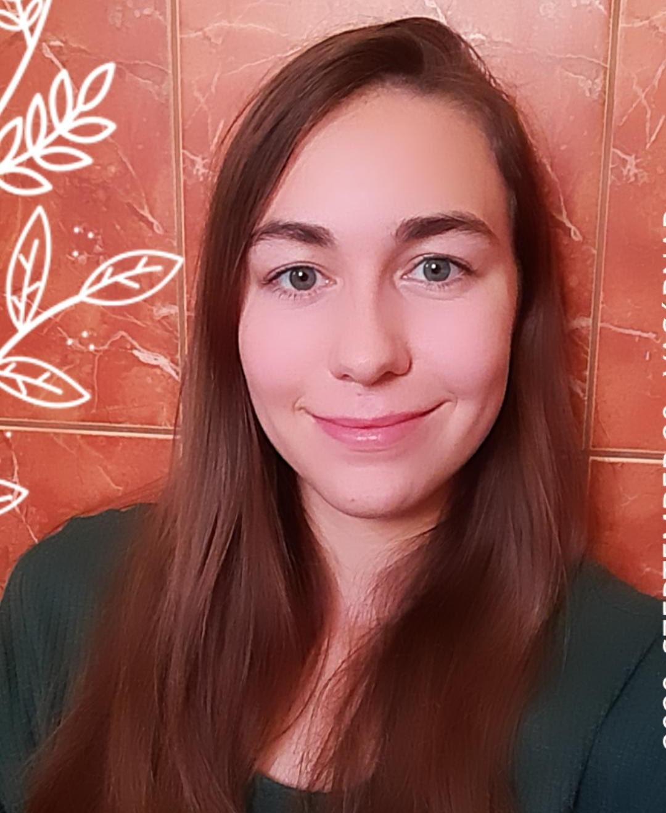

Vadovics Edina a GreenDependent Intézet szakmai vezetője, irányítja a GreenDependent szakmai munkáját a különböző európai és nemzetközi kutatási projektekben (pl. Changing Behaviour, CONVERGE, EnergyPROSPECTS, EU 1.5° Lifestyles) és kampányokban (pl. EnergiaKözösségek, save@work). Vezető szakértőként működött közre társadalmi innovációs projektekben is (pl. URBACT Capitalization, TRANSIT). Kiterjedt kapcsolatrendszerrel rendelkezik a civil, a döntéshozói és az önkormányzati szektorban. Korábban a vállalati környezet- és fenntarthatósági menedzsment területén dolgozott, valamint kapcsolódó egyetemi kurzusokon tanított. Külső szakértőként segítette az Európai Környezetvédelmi Ügynökség (EEA) és az ENSZ Környezetvédelmi Programja (UNEP) munkáját. Számos publikációt írt az alacsony szén-dioxid-kibocsátású életmódról, valamint a Kislábnyom hírlevél szerkesztője. Jelentős tapasztalattal rendelkezik a médiakommunikáció terén. Vadovics Edina tagja a SCORAI Europe (Sustainable Consumption Research and Action Initiative/ Fenntartható Fogyasztáskutatási és Akciókezdeményezés) irányítóbizottságának.

 <table class="picture">
<tr>
<td>

    
  
Vadovics Edina

</td>
</tr>
</table>
