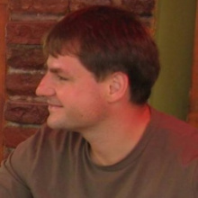

Vadovics Kristóf a Greendependent Intézet gazdasági ügyvezető igazgatója. Nagy tapasztalattal rendelkezik az uniós (pl. H2020, IEE, LIFE+) projektek irányításában, beleértve a multinacionális konzorciumokat, valamint a fenntartható életmóddal kapcsolatos tréningek lebonyolításában és az ezzel kapcsolatos anyagok fejlesztésében. Számos, háztartásokat és önkormányzatokat célzó energiatakarékossági kampány projektmenedzsereként tevékenykedett, pl. EnergyNeighbourhoods, NZEB Open Doors Days, Small Footprint Campaigns. Több nemzeti és nemzetközi konferencia társszervezője volt, amelyek a fenntartható fogyasztással, a nem-növekedéssel és egyéb kapcsolódó témákkal foglalkoztak. Egyik alapítója és önkéntes facilitátora a Gödöllői Klíma Klubnak.

 <table class="picture">
<tr>
<td>

    
  
Vadovics Kristóf

</td>
</tr>
</table>
