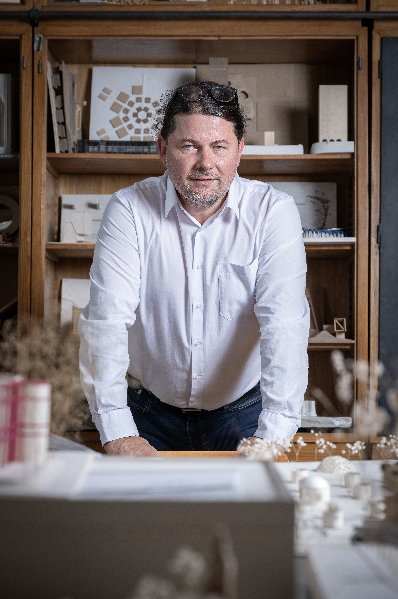

Prof. Vasáros Zsolt DLA építész, egyetemi tanár a BME Exploratív Építészeti Tanszék, és a HAMT (Hungarian Archaeological Mission in Thebes, South Khokha Project ELTE/BME Budapest) vezetője. Az egyetemi oktatás mellett  saját építészeti praxisában, a Narmer Építészeti Stúdióban alkot. Az egyetemi oktatást szervesen egészítik ki az általa vezetett, illetve aktív részvételével folytatott kutatások Egyiptomban, Szíriában és hazánkban.

<table class="picture">
<tr>
<td>

    
  
Prof. Vasáros Zsolt

</td>
</tr>
</table>
