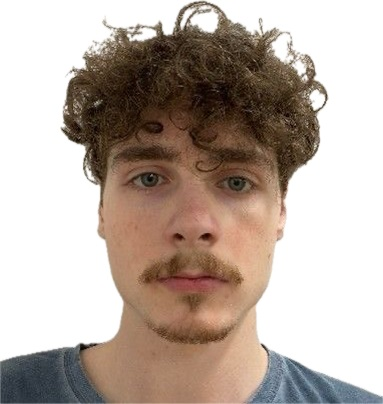

2025-ben, harmadéves hallgatóként csatlakozott az ABÉT Gabonatudomány és Élelmiszerminőség kutatócsoporthoz. A szakdolgozat témája keményítő összetételének mérésével kapcsolatos. 2026 januárban megszerezte BSc diplomáját. Szakmai tevékenységét sikeresen bemutatta a XXVI. Országos MÉTE Tudományos Diákköri Konferencián. 

<table class="picture">
<tr>
<td>

    
  
Vértes Gábor Bendegúz

</td>
</tr>
</table>
