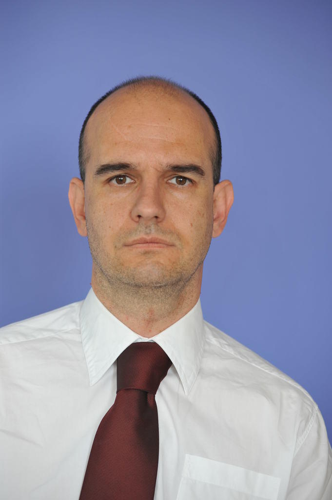

[Dr. Víg Zoltán](https://law.bme.hu/munkatarsaink) jogi diplomát a Szegedi Egyetem Állam- és Jogtudományi Karán szerzett (1998), majd ezt követően LLM (1999) és SJD (PhD) (2006) fokozatokat nemzetközi üzleti jogból a budapesti Közép-európai Egyetemen (CEU). Kutatói ösztöndíjjal dolgozott a Max Planck és az Asser Intézetekben, a Humboldt, Hamburgi, Emory és a Yale Egyetemeken. Öt évig volt a Magyar Tudományos Akadémia kutatója. Gyakorlati tudást a Freshfields Bruckhaus Deringer és a DBP Advokati nemzetközi ügyvédi irodánál szerzett.Több könyve és cikke jelent meg magyar, angol, szerb és német nyelveken. Oktatói karrierje során többek között olyan tárgyakat oktatott mint a nemzetközi beruházási jog, nemzetközi gazdasági jog, társasági jog, EU joga. 
 

<table class="picture">
<tr>
<td>

    
  
Dr. Víg Zoltán

</td>
</tr>
</table>
