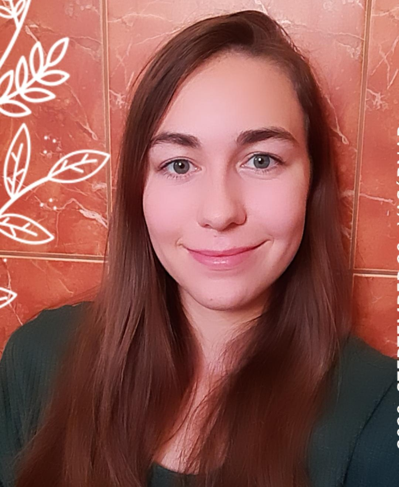

Vincze Dorottya alapszakos környezetmérnök hallgató, a 2024/2025-ös tanévben Egyetemi Kutatói Ösztöndíj Program ösztöndíjas, kutatásaiban a csomagolásmentes üzletek hosszútávú működésének vizsgálatát tűzte ki célul a budapesti agglomerációban. Tanulmányai mellett Dorottya aktív civilszervezeti tevékenységet is folytat, többször adott már elő Fenntarthatósági Témahéten, valamint a ZÖLD XVII ’fenntartható fejlődés Budapest XVII. kerületi csoportja’ aktív közreműködője.

 <table class="picture">
<tr>
<td>

    
  
Vincze Dorottya

</td>
</tr>
</table>
