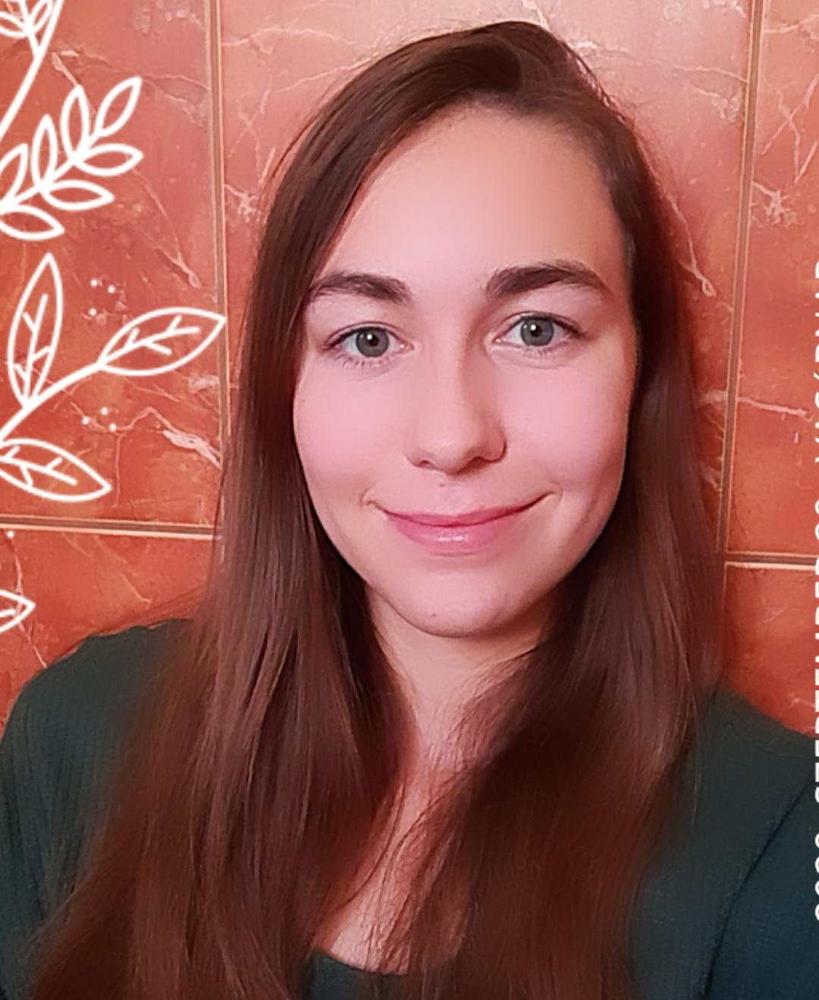

Vincze Dorottya okleveles környezetmérnök, jelenleg a BME GTK Regionális és környezeti gazdaságtan mesterszakos hallgatója. A 2026/2027-es tanévben második alkalommal az Egyetemi Kutatói Ösztöndíj Program ösztöndíjasa, a 2025-ös Közgazdaságtudományi OTDK-n második helyezést ért el. Kutatásaiban a csomagolásmentes üzletek hosszú távú működésének vizsgálatát tűzte ki célul a budapesti agglomerációban és vidéki terekben. Tanulmányai mellett Dorottya aktív civil tevékenységet is folytat: többször adott már elő a Fenntarthatósági Témahéten, valamint a ZÖLD XVII és a BME Egyetemi Zöld Körének önkéntese. A 2024/2025-ös tavaszi félévben a Fenntartható üzleti modellezési gyakorlat kurzus hallgatójaként a Ligeti Csomagolásmentes bolt fenntartható üzleti modell innovációján dolgozott társaival.

 <table class="picture">
<tr>
<td>

    
  
Vincze Dorottya

</td>
</tr>
</table>
