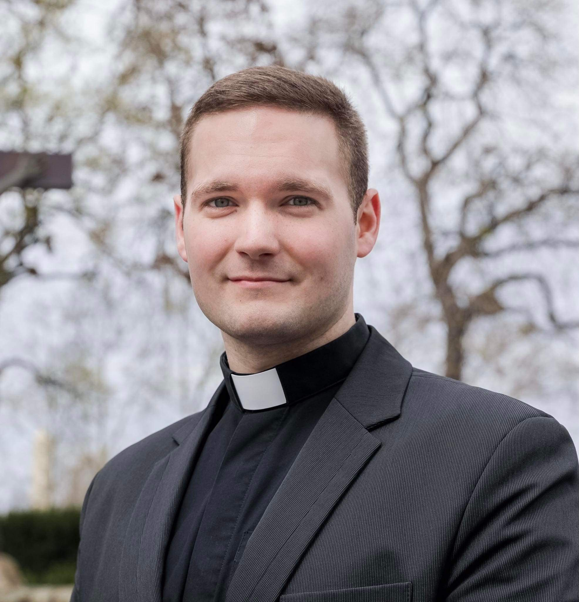

Papnövendék. Sopronban született és tanult, az érettségit követően Budapesten, az Eötvös József Collegium tagjaként szerzett történelem alapszakos diplomát az ELTE Bölcsészettudományi Karán. 
Az egyetemi évek alatt erősödött elhatározássá a vágya, hogy Istent és embertársait papként szolgálja, jelenleg is erre a hivatásra készül.

 <table class="picture">
<tr>
<td>

    
  
Woditsch Péter

</td>
</tr>
</table>
