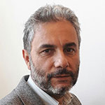

Zarka Dénes, okl. villamosmérnök, oktatásfejlesztő, a Budapesti Műszaki és Gazdaságtudományi Egyetem Mérnöktovábbképző Intézetének igazgatója, valamint az Intézeten belül működő Oktatásinnovációs és Felnőttképzési Központ vezetője. 1992 és 1997 között a Fővárosi Oktatástechnológiai Központ projektmenedzsereként dolgozott, majd 1997-ben az BME Távoktatási Központjának vezető tanácsadójaként kezdte meg műegyetemi pályafutását. 
2016-ban a Központ igazgatója lett, annak a Mérnöktovábbképző Intézettel való összevonásakor az Intézet igazgatójává nevezték ki. Jelentős tapasztalattal rendelkezik az e-learning, a nyílt és távoktatás (ODL), valamint az IKT-kutatás terén, továbbá nemzetközi és hazai projektek menedzselésében, online tananyagfejlesztésben, oktatók képzésében, vállalati kapcsolatok kialakításában és piackutatásban. Ő indította el a digitális tanúsítványok és a nyílt kitűzők (open badges) egyetemi bevezetését és jelenleg ő vezeti azt a munkacsoportot, amely a BME-n az oktatók számára kialakítandó akadémiai támogató rendszer létrehozásán dolgozik.

 <table class="picture">
<tr>
<td>

    
  
Zarka Dénes

</td>
</tr>
</table>
